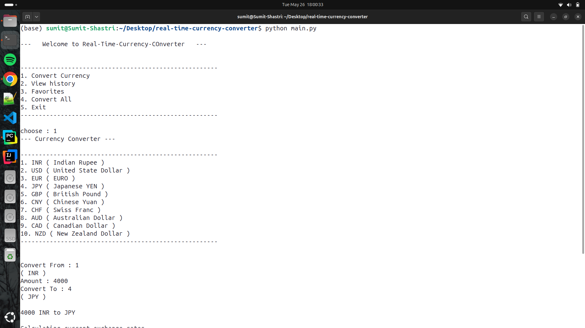
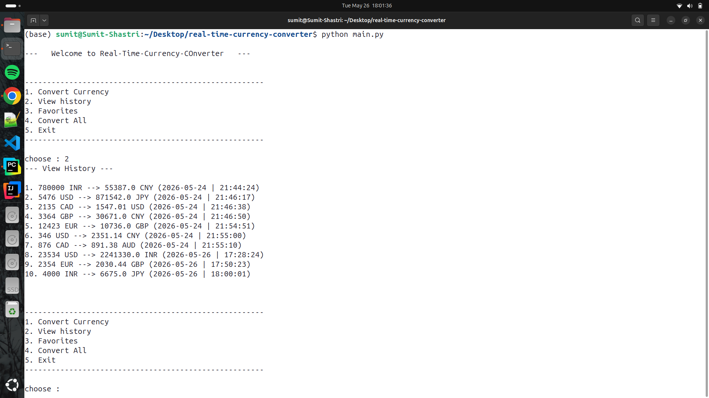
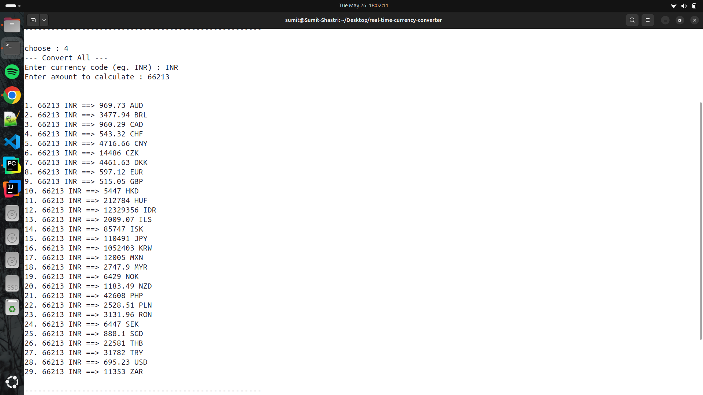

# 💱 Real-Time Currency Converter

A full-featured CLI currency converter built with Python
that uses live exchange rates with history tracking.

---

## 📸 Demo

---

## ✨ Features

- 🔄 Real-time exchange rates via Frankfurter API
- 💾 Conversion history saved to CSV
- 📊 View last 10 conversions
- ⭐ Favorite currency pairs tracker
- 🌍 Convert to ALL currencies at once
- ✅ Full input validation

---

## 🛠️ Tech Stack

- Python 3.10+
- Requests
- Pandas
- CSV
- Frankfurter API (free, no key needed)

---

## ⚙️ Installation

git clone https://github.com/Sumit-Shastri/real-time-currency-converter
cd real-time-currency-converter
pip install -r requirements.txt

---

## 🚀 Usage

python main.py

Then follow the menu:
1. Convert Currency
2. View History
3. Favorites
4. Convert All
5. Exit

---

## 📁 Project Structure

real-time-currency-converter/
├── main.py          → Menu and user interaction
├── api.py           → API calls
├── utils.py         → CSV, history, favorites
├── history.csv      → Persistent storage
├── requirements.txt
└── README.md

---

## 👨‍💻 Author

Sumit Shastri
GitHub : github.com/Sumit-Shastri
LinkedIn : linkedin.com/in/sumitshastri-dev